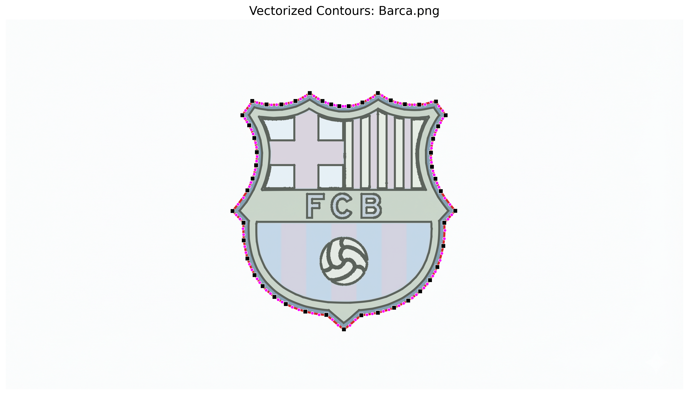
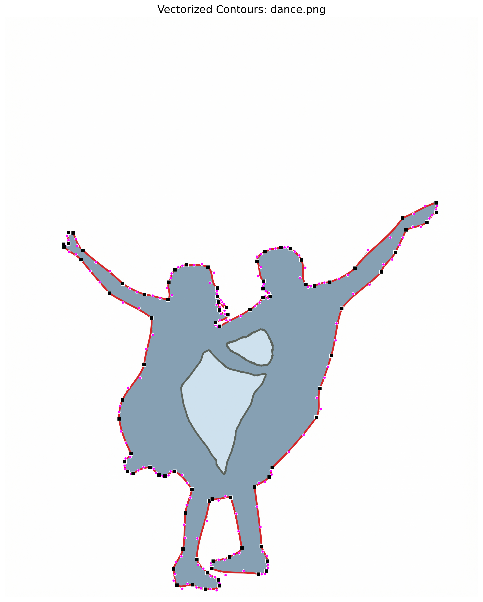
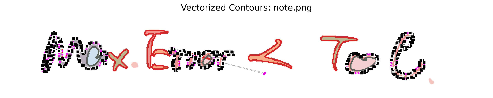
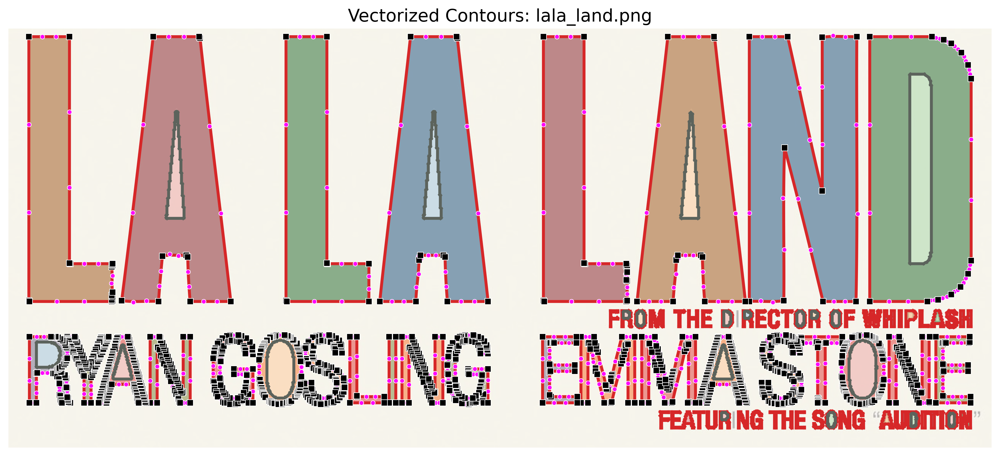

```markdown
# Bezier-Curve-Parameter-Reading-With-CV 🎨

A robust Python-based tool that utilizes **Computer Vision (OpenCV)** and **Numerical Optimization (SciPy)** to transform bitmap images into high-quality, parametric **Cubic Bezier Curves**.

---

## ✨ Key Features
- **Automated Contour Extraction**: Uses OpenCV's `findContours` with hierarchical tree support to accurately handle complex shapes and "holes."
- **Smart Anchor Detection**: Employs the `approxPolyDP` algorithm to identify critical corner points for segmenting contours.
- **High-Precision Curve Fitting**: Leverages the `least_squares` optimization algorithm to calculate optimal control points ($P_1, P_2$) by minimizing the residual between sample points and the cubic Bezier model.
- **Advanced Visualization**: 
    - Renders smooth vector paths.
    - Visualizes control handles and anchors for debugging.
    - Supports hierarchical color filling for multi-layered shapes.

---

## 🚀 Quick Start

### 1. Prerequisites
Ensure you have Python 3.x installed along with the following dependencies:
```bash
pip install opencv-python numpy matplotlib scipy

# Bezier-Curve-Parameter-Reading-With-CV 🎨

A Python tool to convert bitmap images into smooth cubic Bezier curves using OpenCV and Scipy.

---

## 📊 Showcases (Original vs. Vectorized)

| Input Bitmap (Original) | Vectorized Output (Rendered) |
| :---: | :---: |
|  |  |
|  |  |
|  |  |
|  |  |

---


## 📜 License

Distributed under the **MIT License**. See `LICENSE` for more information.

Developed by [Phil-1030](https://www.google.com/search?q=https://github.com/Phil-1030)

```


```
