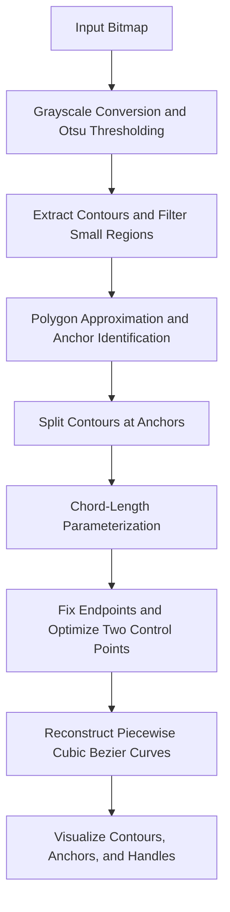
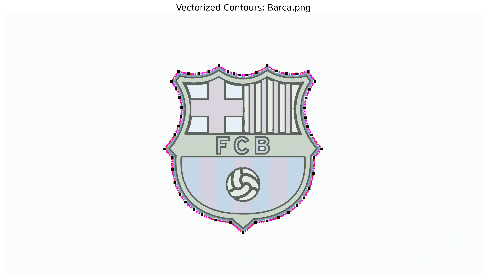
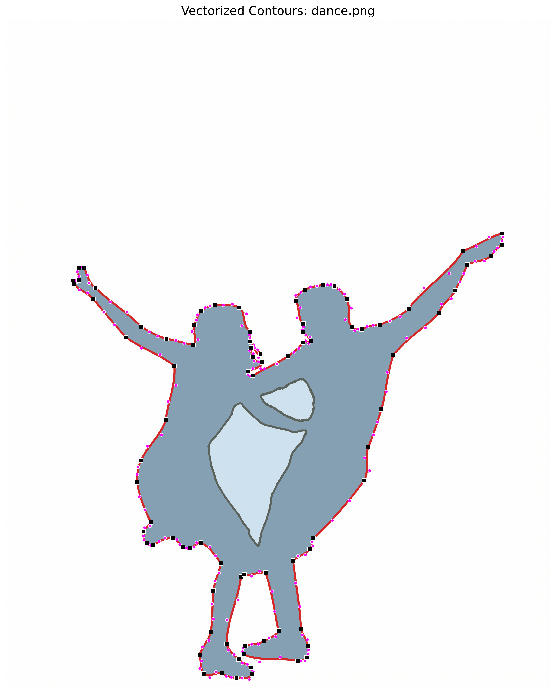

# Bezier Curve Parameter Estimation with Computer Vision

Combining **OpenCV contour extraction** with **SciPy least-squares fitting** to approximate bitmap boundaries with piecewise cubic Bezier curves and visualize their anchors, control points, and handles.

## Background

Logos, icons, and silhouettes are often stored as bitmap images. Their boundaries consist of discrete pixels, making them difficult to use directly for curve editing or geometric analysis. Manually tracing these shapes requires placing anchors and adjusting control handles segment by segment.

This project automates that process: **extract contours from an image, identify segment boundaries, and estimate the Bezier parameters that describe each segment.**

## Methodology and Workflow

### 1. Image preprocessing and contour extraction

Convert the input image to grayscale and apply **Otsu thresholding** with binary inversion to separate foreground regions.

OpenCV extracts dense contours and their parent–child relationships using `findContours` with `RETR_TREE` and `CHAIN_APPROX_NONE`. Regions smaller than 50 pixels in contour area are skipped before fitting.

### 2. Anchor identification and contour segmentation

A complex boundary can contain arcs, straight sections, and sharp corners that are difficult to describe with a single cubic Bezier curve. The algorithm identifies representative anchors and splits the contour into independently fitted segments.

**Polygon approximation.** OpenCV's `approxPolyDP` simplifies the contour to a polygon with fewer vertices. The approximation tolerance is set to **0.1% of the contour perimeter**:

```python
epsilon = 0.001 * cv2.arcLength(contour, True)
anchors = cv2.approxPolyDP(contour, epsilon, True)
```

A smaller tolerance generally preserves more vertices and local detail; a larger tolerance produces a simpler outline. The resulting vertices serve as anchors, both at sharp corners and along curved boundaries.

**Mapping anchors to the original contour.** For each anchor, the algorithm computes Euclidean distances to the original contour points and selects the nearest point's index. Sorting these indices preserves the contour's traversal order while retaining the dense samples needed for fitting.

**Closing the segmentation loop.** All contour points between consecutive anchors form a segment. The final segment joins the end of the contour to its beginning, connecting the last anchor back to the first.

Each segment's anchors become the fixed endpoints $P_0$ and $P_3$. The remaining samples guide the estimation of $P_1$ and $P_2$. Adjacent curves share endpoints, but the current implementation does not enforce matching tangent directions at their joins.

### 3. Cubic Bezier fitting

Each segment is represented by four points:

$$
B(t)=(1-t)^3P_0+3(1-t)^2tP_1+3(1-t)t^2P_2+t^3P_3,\qquad t\in[0,1]
$$

The endpoints $P_0$ and $P_3$ remain fixed, while the internal control points $P_1$ and $P_2$ are optimized.

**Chord-length parameterization** assigns each sample a value of $t$ based on its cumulative distance along the contour. SciPy's `least_squares` then minimizes coordinate residuals between the sampled Bezier curve and the original contour points.

### 4. Reconstruction and visualization

Sample the fitted curves and overlay them on a faded version of the input image. Region fills, anchors, control points, and handles help explain and inspect the approximation.


```mermaid
flowchart TD
    A["Input Bitmap"] --> B["Grayscale Conversion and Otsu Thresholding"]
    B --> C["Extract Contours and Filter Small Regions"]
    C --> D["Polygon Approximation and Anchor Identification"]
    D --> E["Split Contours at Anchors"]
    E --> F["Chord-Length Parameterization"]
    F --> G["Fix Endpoints and Optimize Two Control Points"]
    G --> H["Reconstruct Piecewise Cubic Bezier Curves"]
    H --> I["Visualize Contours, Anchors, and Handles"]
```

## Results

The following examples illustrate the fitted contours and control-point layouts. The rendered outputs include the original image as a faded background for comparison.

### FC Barcelona crest

The crest demonstrates curved edges, sharp corners, and internal contours within a detailed emblem.

| Original bitmap | Bezier fitting visualization |
|:---:|:---:|
|  |  |

### Dancing silhouettes

The dancers demonstrate irregular human outlines, local changes in direction, and interior gaps between connected shapes.

| Original bitmap | Bezier fitting visualization |
|:---:|:---:|
|  |  |

In these examples, black squares mark anchors and magenta dots mark internal control points on the highlighted outer contours. The visualizations show how a sequence of parameterized curves can approximate a bitmap boundary.

> The current implementation saves PNG visualizations. It does not yet export SVG paths or control-point data files, and no standardized fitting-error or runtime benchmark is included. Estimated curves approximate the bitmap boundary; they do not necessarily recover the original design's Bezier parameters.

## Project Files

The main implementation is located in `image-to-bezier-vectorizer/`.

```text
Bezier-Curve-Parameter-Reading-With-CV/
├── README.md
├── LICENSE
└── image-to-bezier-vectorizer/
    ├── main.py
    ├── requirements.txt
    └── assets/
        ├── image_materials/       # Example input bitmaps
        └── rendered_outputs/     # Saved fitting visualizations
```

| File or directory | Purpose |
|---|---|
| `main.py` | Implements preprocessing, contour extraction, anchor identification, curve fitting, and visualization. |
| `requirements.txt` | Lists OpenCV, NumPy, Matplotlib, and SciPy dependencies. |
| `assets/image_materials/` | Contains example inputs, including the crest, silhouettes, and musical note. |
| `assets/rendered_outputs/` | Contains example renderings of fitted contours and control points. |
| `LICENSE` | Contains the MIT License for the project. |

The core functions in `main.py` are:

| Function | Role |
|---|---|
| `cubic_bezier()` | Computes curve coordinates from four control points and parameter values $t$. |
| `fit_cubic_bezier_to_segment()` | Parameterizes a contour segment by chord length and estimates its two internal control points. |
| `vectorize_image_bezier()` | Runs the image loading, contour segmentation, fitting, and plotting pipeline. |

The input image path is specified at the end of `main.py`. The script saves its visualization as `output5.png` in the current working directory.

## License

Distributed under the [MIT License](LICENSE).
